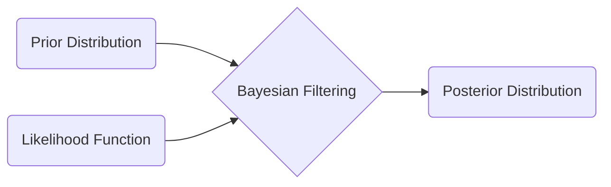
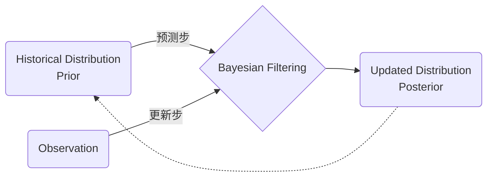

**目录**

[TOC]

# 贝叶斯滤波
**核心**
使用新观测值优化既有分布。

## 三个概率

**Prior Distribution 先验概率分布**
结合已有信息推测的概率分布。
初值往往是主观概率分布。

**Likelyhood Distribution 似然概率分布**
“似然”的概念可参考最大似然估计，是一种由果溯因的概率分布。也就是说，在已知结果的情况下，这个结果诞生于某个概率分布下的概率分布。

**Posterior Distribution 后验概率分布**
修正后的概率分布。

**三个概率的关系**
设对于随机变量X，X=x的先验概率分布为
$$
P(X=x)
$$
，现在收集到新的观测值$X_m=x_0$，可知似然概率分布为
$$
P(X_m=x_0\mid X=x)
$$
，后验概率分布为
$$
P(X=x\mid X_m=x_0)
$$
由条件概率可知：
$$
P(X=x\mid X_m=x_0)=\frac{P(X_m=x_0\mid X=x)P(X=x)}{P(X_m=x_0)}
$$

这里$P(X_m=x_0)$不能理解为一个确定性事件。这是因为这个这个概率发生在实际取得$x_0$之前。并且，$P(X_m=x_0)$和X的取值无关，和X的分布有关。
$\therefore P(X_m=x_0)$ 是一个**常数**。
因此上面条件概率式子可以简化为：
$$
P(X=x\mid X_m=x_0)=\eta\cdot P(X_m=x_0\mid X=x)P(X=x)
$$

## 贝叶斯滤波算法
一种思想：不断收集新的观测值以修正现有的概率分布。

**贝叶斯滤波算法的数学形式**
预测方程：从历史值预测当前值，$Q_k$是误差
$$
X_k=f(X_{k-1})+Q_k
$$
观测方程：观测值和真实值之间的关系
$$
X^m_k=h(X_k)+R_k
$$
先验概率
$$
f_k^-(x)=\int^{+\infin}_{-\infin}f_Q[x-f(z)]f_{k-1}^+(z)\mathrm{d}z
$$
观测值系数
$$
\eta=\frac{1}{\int^{+\infin}_{-\infin}f_R[y_k-h(x)]f_k^-(x)\mathrm{d}x}
$$
后验概率
$$
f_k^+(x)=\eta f_R[y_k-h(x)]f^-_k(x)
$$
**贝叶斯滤波算法的分支**
对于棘手的无穷积分，不同的解决方法对应不同的分支：
1. 无穷积分太复杂，我就假设其函数已知。
  - 卡尔曼滤波 Kalman Filter ：$f(X),h(X)$是线性的，$Q,R$是均值为0的正态分布
  - 非线性卡尔曼滤波

2. 就要解积分。
  - 直方图滤波：用直方图逼近积分
  - 粒子滤波：蒙特卡洛积分

## Kalman滤波
**基本形式**

假设$f(X_{k-1})=F\cdot X_{k-1},h(X_k)=H\cdot X_k,Q\sim N(0,Q),R\sim N(0,R)$
带入贝叶斯滤波，会得到Kalman增益：
$$
K=\frac{H\sigma_k^-}{H^2\sigma_k^-+R}
$$
从k的先验概率到k的后验概率的修正可以表示为对其均值和方差(这里用$\sigma$表示)的修正：
$$
\begin{cases}
\mu_k^-=F\cdot\mu_{k-1}^+ \\
\sigma_k^-=F^2\cdot\sigma_{k-1}^++Q^2
\end{cases}
\Rightarrow 
\begin{cases}
\mu_k^+=\mu_k^-+K(x_k-H\cdot\mu_k^-) \\
\sigma_k^+=(1-KH)\sigma_k^-
\end{cases}
$$
当$R\gg \sigma_k^-\Rightarrow K\rightarrow 0$，此时$\mu_k^+=\mu_k^-$，即先验分布更可信。

**矩阵形式**

此时均值$\mu_k$是一个向量$\overrightarrow{\mu_k}$，方差$\sigma_k^2$是协方差矩阵$\Sigma_k$，形式如下：
$$
\overrightarrow{\mu}_k^-=F\cdot \overrightarrow{\mu}_{k+1}^+ \\
\Sigma_k^-=F\cdot \Sigma_{k-1}^+\cdot F^T+Q \\
K=\Sigma_k^-H^T(H\Sigma_k^-H^T+R)^{-1} \\
\overrightarrow{\mu}_k^+=\overrightarrow{\mu}_k^-+K(\overrightarrow{x}_k-H\cdot \overrightarrow{\mu}_k^-) \\
\Sigma_k^+=(I-KH)\Sigma_k^-
$$
