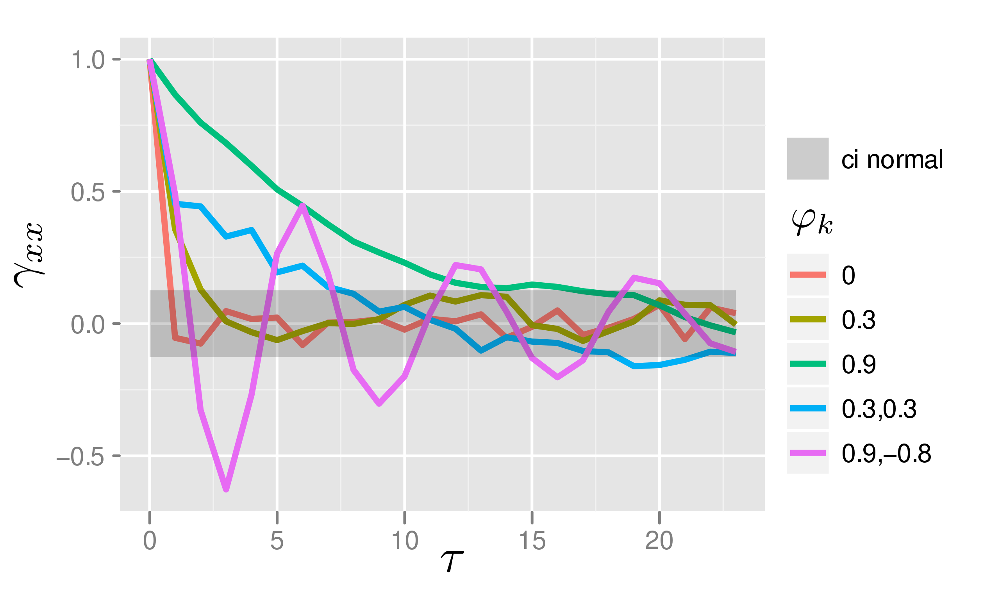
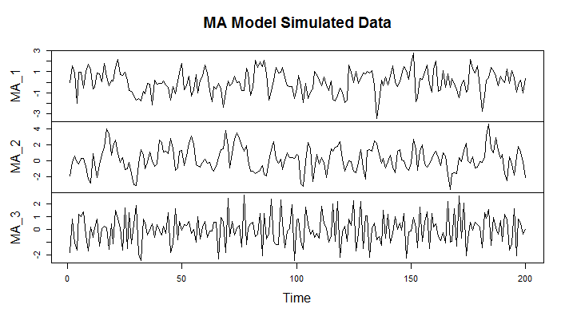

**目录**
 [TOC]

# 1 时间序列分析

**随机时间序列**
按照时间顺序排列的一组随机变量
$$
X_1, X_2, ..., X_t,...
$$
表示一个随机事件的时间序列，记为$\{X_t, t\in T\}$

**观察值序列**
用$x_1, x_2, ..., x_n$表示随机序列的n个有序观察值，称为长度为n的观察值序列。
观察值序列是随机时间序列的一个实现，一次抽样过程。

> 研究目的：揭示随机时间序列的性质
> 研究方法：通过观察值序列进行推断

**时间序列分析方法**
- 描述性时序分析：直观比较、绘图
- 统计时序分析：数理统计学分析
  - 频率分析（频谱分析、谱分析）：假设任何一种无趋势的时间序列都可以分解成若干不同频率的周期波动。早期借助傅里叶分析，然后是傅里叶变换，最后引入了最大熵谱估计理论。是非常有效的动态数据分析方法。
  - 时域分析：从序列自相关的角度揭示时间序列的发展规律，用数学模型进行拟合。

## 1-1 时间序列的预处理
### 1-1-1 平稳性检验

**时间序列的概率分布**

m是正整数，$t_1,t_2,...,t_m\in T$，则m维随机向量$(X_{t_1},X_{t_2},...,X_{t_m})$的联合概率分布是
$$
F_{t_1,t_2,...,t_m}(x_1,x_2,...,x_m)=P(X_{t_1}\le x_1,X_{t_2}\le x_2,...,X_{t_m}\le x_m)
$$
这些有限维的分布函数的全体称为时间序列的概率分布族。
但是分布函数根本得不到……只能研究**序列的低阶矩（特征统计量）**。

**时间序列的均值**
对于时间序列$\{X_t, t\in T\}$，任意时刻的序列值$X_t$是一个随机变量。记分布函数为$F_t(x)$，若
$$
\int^{\infin}_{-\infin}x\mathrm{d}F_t(x)<\infin
$$
则一定存在常数$\mu_t$，它满足
$$
\mu_t=E(X_t)=\int^{\infin}_{-\infin}x\mathrm{d}F_t(x)
$$
称$\mu_t$是序列在t时刻的均值函数。取遍所有的观察时刻，就构成均值序列。

**时间序列的方差**
当$\int^{\infin}_{-\infin}x^2\mathrm{d}F_t(x)<\infin$，定义时间序列的方差函数
$$
\sigma^2_t=D(X_t)=E(X_t-\mu_t)^2=\int^{\infin}_{-\infin}(x-\mu_t)^2\mathrm{d}F_t(x)
$$
取遍所有的观察时刻，就构成方差序列。

**时间序列的自协方差**
衡量时间序列在不同时间点的变化程度（波动性）。
对于时间序列$\{X_t, t\in T\}$，任取$t,s\in T$，自协方差函数定义为：
$$
r(t,s)=E(X_t-\mu_t)(X_s-\mu_s)
$$

**时间序列的自相关系数**
衡量时间序列不同时间点的线性相关程度（随机性）。
对于时间序列$\{X_t, t\in T\}$，任取$t,s\in T$，自相关系数定义为：
$$
\rho(t,s)=\frac{r(t,s)}{\sqrt{D(X_t)\cdot D(X_s)}}
$$

**严平稳**
序列的所有统计性质都不会随着时间变化。

**宽平稳**
序列的低阶矩（二阶）不随时间变化。即
1. $\forall t\in T,E(X^2_t)<\infin$
2. $\forall t\in T,E(X_t)=\mu$
3. $\forall t,s\in T,r(t,s)=r(t+\tau,s+\tau)\Rightarrow D(X_t)=r(t,t)=r(0)$

由性质3定义宽平稳时间序列的延迟k自协方差，即**k阶自协方差函数**$\gamma(k)=\gamma(t,t+k),\forall k\in\Nu$，延迟k自相关系数，即**k阶自相关系数**$\rho_k=\frac{\gamma(t,t+k)}{\sqrt{D(X_t)\cdot D(X_{t+k})}}=\frac{\gamma(k)}{\gamma(0)}$
### 1-1-2 纯随机性检验

**纯随机序列**
序列值之间不相互影响。数学定义是：如果时间序列$\{X_t, t\in T\}$满足性质：
$$
E(X_t)=\mu,\forall t\in T\\
\gamma(t,s)=\begin{cases}
    \sigma^2,&t=s \\
    0,&t\ne s
\end{cases},\forall t,s\in T
$$
则称其为白噪声序列（纯随机序列），记为$X_t\sim WN(\mu,\sigma^2)$
理论上，白噪声序列的自协方差和自相关系数都是0，但是观察值序列有限的时候，可能只是接近0
残差序列具有纯随机性则表明序列信息提取充分。

**方差齐性**
序列的每个变量的方差都相等。
根据Markov定理，只有方差齐性的序列，用最小二乘法得到的未知参数估计值才是准确有效的。

**Barlett定理**
一个纯随机时间序列的n期观察序列$\{x_t,t=1,...,n\}$的延迟k（k不为0）期的样本自相关系数将近似服从均值为0，方差为$\frac 1n$的正态分布。
根据Barlett定理检验纯随机性：
**纯随机性检验**
- 原假设：延迟期数小于等于m的序列值之间相互独立（$H_0:\rho_1=\rho_2=L=\rho_m=0,\forall m\ge 1$）
- 备择假设：延迟期数小于等于m的序列值之间不相互独立（$H_1:\exist \rho_k\ne 0,\forall m\ge 1,k\le m$）
- 检验统计量：由Barlett定理得到Q统计量$Q=n\sum\limits^m_{k=1}\hat{\rho_k}^2\sim\chi^2(m)$，在大样本下更精确的统计量是**QLB统计量**$LB=n(n+2)\sum\limits^m_{k=1}(\frac{\hat{\rho_k}^2}{n-k})\sim\chi^2(m)$
- 判别原则：当Q大于$\chi_{1-\alpha}^2(m)$分位点，或者P(Q)<α，可以以1-α的置信度拒绝原假设，即该序列不是白噪声序列。

## 1-2 分析平稳时间序列
目的：提取平稳序列中的信息。
方法：用平稳时间序列模型拟合目标平稳序列。
### 1-2-1 工具
**p阶差分**
差分就是序列中相邻值作差，反应序列的变化率。
$$
\Delta^px_t=\Delta^{p-1}(\Delta x_t)=\Delta^{p-1}x_t-\Delta^{p-1}x_{t-1}
$$
**k步差分**
$$
\Delta_kx_t=x_t-x_{t-k}
$$
**延迟算子**
相当于将当前序列值的时间回溯一个时刻，记为B。
$$
x_{t-1}=Bx_t \\
... \\
x_{t-p}=B^px_t
$$
**线性差分方程**
可以表征一个序列所包含的特征。
1. 常用于分析自协方差函数和自相关函数；
2. 特征根用于判别稳定性。
$$
z_t+a_1z_{t-1}+...+a_pz_{t-p}=h(t)
$$
当h(t)=0时为齐次。

求解的方式可以参考线性微分方程。如对于齐次线性差分方程求解：
1. 求对应特征方程的特征根。特征方程$\lambda^p+a_1\lambda^{p-1}+...+a_p=0$有p个根，即特征根$\lambda_1...\lambda_p$
2. 求通解，分不同情形：不相等的实根、相等的实根、复数根。

非齐次线性差分方程还需要一个特解。

### 1-2-2 平稳时间序列模型

平稳时间序列的建模步骤：
1. 检验其是平稳非白噪声序列；
2. 计算样本的自（偏）相关系数，用来模型识别（重点关注**中心化ARMA模型**）
3. 参数估计
4. 模型检验
5. 模型优化
6. 预测

使用一个时间序列的历史值和随机扰动项建立的数学模型$X_t=F(X_{t-1},X_{t-2},...,\mu_t)$，重点：
1. 具体形式
2. 时序变量的滞后期
3. 随机扰动项的结构

平稳时间序列模型有：
**AR模型**
即p阶自回归（AutoRegression）模型，AR(p)的t时刻序列值受到过去p时间段内历史值的影响，以及一个和历史序列值无关的白噪声残差。
$$
\begin{cases}
    x_t=\varphi_0+\varphi_1x_{t-1}+\varphi_2x_{t-2}+...+\varphi_px_{t-p}+\epsilon_t \\
    \varphi_p\ne 0 \\
    \epsilon_t 是白噪声 \\
    E(x_s\epsilon_t)=0,\forall s<t
\end{cases}
$$

$\varphi_0=0$时成为中心化AR(p)模型。
对于任意的AR序列模型，可以通过平移将其转为中心化的AR序列模型。构造方式是：
令$\mu=\frac{\varphi_0}{1-\sum\limits_{i=1}^p\varphi_i}$，则$x_t-\mu=\varphi(x_{t-1}-\mu)+...+\varphi_p(x_{t-p}-\mu)+\epsilon_t$
- 均值：$E(x_t)=\frac{\varphi_0}{1-\sum\limits_{i=1}^p\varphi_i}$
- （k阶）自相关系数（k阶自协方差除以方差）的通解形式：$\rho_k=\frac{\gamma_k}{\gamma_0}=\sum\limits^p_{i=1}c_i\lambda_i^k,\mid\lambda_i\mid<1\land c_i不恒为0$
- AR模型自相关系数的特点：
  - 指数衰减，证明AR序列的相关性往往出现在短期。
  - 拖尾性：不会在后期变为0，始终有非0的取值。

**MA模型**
即q阶移动平均（MovingAverage）模型，MA(q)的t时刻序列值受到一个白噪声序列过去q时间段内历史值的影响。
$$
\begin{cases}
    x_t=\mu+\epsilon_t+\theta_1\epsilon_{t-1}+...+\theta_q\epsilon_{t-q} \\
    \theta_q\ne 0 \\
    \{\epsilon_t\}是零均值白噪声序列 
\end{cases}
$$

$\mu=0$时称为中心化MA(q)模型。
- 均值是常数：$E(x_t)=E(\mu+\epsilon_t-\theta_1\epsilon_{t-1}-...-\theta_q\epsilon_{t-q})=\mu$
- 方差是常数：$D(x_t)=D(\mu+\epsilon_t-\theta_1\epsilon_{t-1}-...-\theta_q\epsilon_{t-q})=(1+\theta_1^2+...+\theta_q^2)\sigma^2_\epsilon$

**ARMA模型**

即自回归移动平均模型ARMA(p,q)
$$
\begin{cases}
  x_t=\phi_0+\phi_1x_{t-1}+...+\phi_px_{t-p}+\epsilon_t-\theta_1\epsilon_{t-1}-\theta_q\epsilon_{t-q} \\
  \{\epsilon_t\}是零均值白噪声序列 \\
  E(x_s\epsilon_t)=0,\forall s<t
\end{cases}
$$

$\phi_0=0$时称为中心化ARMA(p,q)模型。

**模型的平稳性**
即该模型生成的时间序列是平稳的，互为充要条件。

**模型的可逆性**
一个时间序列可以用它的过去值来表示，而不需要用未来值。
这样的时间序列可以用一个无限阶的MA模型来表示，即
$$
Z_t​=\mu+\sum\limits^{\infin}_{j=0}\psi_ja_{t-j}
$$​
其中，at​是白噪声，ψj​是MA系数，μ是常数。可逆性的好处是可以用过去的信息来预测未来的值，而不需要知道未来的误差。可逆性也与平稳性和因果性有关，因为一个平稳的ARMA模型一定是可逆的，而一个可逆的MA模型一定是因果的。

### 1-2-3 模型参数估计

**矩估计**
不假设总体分布，只用到少量样本的自相关系数信息，估计精度低。
**极大似然估计**
- 极大似然准则：认为样本来自使该样本出现概率最大的总体，所以未知参数的极大似然估计就是使得似然函数（联合密度函数）取得最大值的参数。

极大似然估计充分应用了每一个观察值所提供的信息，估计精度高；但是需要假定总体分布。
**最小二乘估计**
使得残差平方和达到最小的那组参数值就是最小二乘估计值。

### 1-2-4 模型检验与优化
**模型检验**
1. 检验模型参数是否显著非零，精简模型参数
2. 检验模型的残差序列是否为白噪声

**模型优化**
实际上就是在多个模型中找出相对最优模型，这需要确定比较规则，构造出适当的统计量。

1. 残差方差图定阶法
2. F检验定阶法
3. 最佳准则函数定阶法（结果越小越优）
   1. AIC准则：似然函数值越大越好，未知参数越少越好。设模型的参数个数为M，极大似然函数为F(x)，则$AIC(M)=-2\ln F(x)+2M$，在ARMA正态分布假定下，AIC的简化式为$AIC(M)=n\ln \hat{\sigma^2_a}+2M$，其中$\hat{\sigma^2_a}$是残差方差的极大似然估计值，n是样本个数。
   2. SBC准则：设模型的参数个数为M，极大似然函数为F(x)，则$AIC(M)=-2\ln F(x)+M\ln n$，在ARMA正态分布假定下，AIC的简化式为$AIC(M)=n\ln \hat{\sigma^2_a}+M\ln n$。

### 1-2-5 时间序列预测

根据现在与过去的样本，对未来某一时刻的随机变量进行估计（点或者区间）。
称为以t为原点，向前步长为l的预测，记为$\hat{X_t}(l)$

**最小均方误差预测**
预测误差就是真实值减去预测值。
- 预测误差的方差和步长l有关，和原点无关。
- 步长l越大，预测误差的方差也越大，即预测准确性越差。

**条件期望预测**

在已知$x_t,x_{t-1},...$的条件下，取$x_{t+l}(l>0)$的条件期望作为预测值。

**适时修正预测**

如果有新的信息加入，怎么使用新信息对预测进行修正？
 

 ## 1-3 非平稳时间序列的随机分析
 ### 1-3-1 分解和提取

**Wold分解定理**
任何离散平稳过程都可以分解为两个不相关的平稳序列之和，其中**一个为确定性的，一个为随机性的**。记作：
$$
x_t=V_t+\xi_t, \xi_t=\sum\limits^{\infin}_{j=0}\varphi_j\epsilon_{t-j} 
$$
其中$\epsilon_t$是白噪声，$\varphi_0=1\land \sum\limits^{\infin}_{j=0}\varphi_j^2<\infin,\bold{cov}(V_t,\epsilon_s)=0,\forall t\ne s$

**确定性序列和随机性序列**
对于序列$y_t$，使用滞后q期之前的序列（也就是向前推q期）进行回归，得到
$$
y_t=\alpha_0+\alpha_1y_{t-q}+\alpha_2y_{t-q-1}+...+\upsilon_t
$$
这里$\upsilon_t$是残差序列，可以理解为回归误差。其方差$\sigma_\upsilon^2(q)$可以衡量历史信息预测当前序列值$y_t$的精度。
- $\lim\limits_{q\rightarrow\infin}\sigma_\upsilon^2(q)=0$ 说明序列发展具有强规律性，历史数据的预测非常准，则称序列$\{y_t\}$是确定性序列。
- $\lim\limits_{q\rightarrow\infin}\sigma_\upsilon^2(q)=D(y_t)$ 说明序列发展很随机，历史数据的预测不准，则称序列$\{y_t\}$是随机性序列。

> 显然$\sigma_\upsilon^2\le D(y_t)$，所以这里的意思就是残差序列的方差越大则随机性越强。

**Cramer分解定理**

任何一个时间序列$\{x_t\}$都可以分解为两部分叠加：一部分是由多项式决定的确定性趋势成分，另一部分是平稳的零均值误差成分。即
$$
x_t=\mu_t+\epsilon_t=\sum\limits_{j=0}^d\beta_jt^j+\Psi(B)a_t
$$
其中d是非负整数，$\beta_1,...,\beta_d$是常数系数，$\{a_t\}$是零均值白噪声序列，$\Psi(B)$是延迟算子多项式。如果$\{x_t\}$是不稳定的，那么两部分至少有一个是不稳定的。

**差分运算提取确定性趋势**
因为确定性成分表现为多项式，所以d阶差分序列的确定性趋势为常数：
$$
E(\Delta^dx_t)=c
$$
其实质是去除趋势随时间的变化。因为常数的确定性趋势即“不变”是最容易观察的，所以将确定性趋势差分为常数就是把它提取出来了。

**周期性序列需要进行步长为周期的差分**

**使用差分运算提取序列的确定性信息本质上是使用自回归的方法提取序列的确定性信息**，这是因为对确定性趋势的d阶差分可以看作
$$
\Delta^dx_t=\sum\limits^d_{i=0}(-1)^iC_d^ix_{t-i} \Rightarrow \\
x_t=\sum\limits^d_{i=1}(-1)^{i+1}C_d^ix_{t-i}+\Delta^dx_t
$$
这就是一个$x_t$关于$x_{t-1},x_{t-2},...,x_{t-d}$的d阶自回归过程，$\Delta^dx_t$衡量的是自回归过程产生的随机误差大小。

